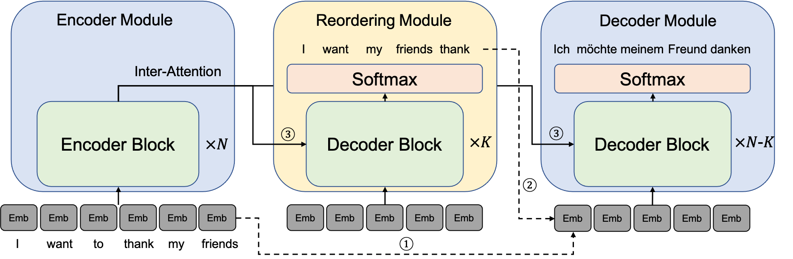

# Guiding Non-Autoregressive Neural Machine Translation Decoding with Reordering Information

This is the implementation of **Guiding Non-Autoregressive Neural Machine Translation Decoding with Reordering Information**. The code is based on [OpenNMT](https://github.com/OpenNMT/OpenNMT-py).

## Introduction
Non-autoregressive neural machine translation (NAT) generates each target word in parallel and has achieved promising inference acceleration. However, existing NAT models still have a big gap in translation quality compared to autoregressive neural machine translation models due to the multimodality problem: the target words may come from multiple feasible translations. To address this problem, we propose a novel NAT framework ReorderNAT which explicitly models the reordering information to guide the decoding of NAT. Specially, ReorderNAT utilizes deterministic and non-deterministic decoding strategies that leverage reordering information as a proxy for the final translation to encourage the decoder to choose words belonging to the same translation. 



## Prerequisite

To use this source code, you need Python3.6+. And the python dependencies can be installed as follows:

```
pip install -r requirements.txt
```

## Usage

### Preprocessing

We use [fast\_align](https://github.com/clab/fast_align) to get alignment information which is used to supervise the reordering module with the following command. `[FAST_ALIGN]` is the path of the fast\_algin tool. `[DISTILLED_TGT]` is the path of the file containing sentences generated in sequence-level distillation. And `[OUTPUT_DIR]` is the directory to save the alignment information.

```
sh get_alignment.sh [FAST_ALIGN] [TRAIN_SRC] [TRAIN_TGT] [DISTILLED_TGT] [OUTPUT_DIR]
```

### Training

To train a Transformer, the following command can be used. `[DATASET]` is the name of the dataset used.

```
python train.py \
    --model_name Transformer \
    --dataset [DATASET] \
    --train_src_file [TRAIN_SRC] \
    --train_tgt_file [TRAIN_TGT] \
    --valid_src_file [VALID_SRC] \
    --valid_tgt_file [VALID_TGT] \
    --vocab_path [VOCAB_PATH]

```

To train a ReorderNAT, you can use the following command. `USE_AR_REORDER` indicates whether to perform reordering in an autoregressive way or not. `ALIGNMENT_FILE` is the path of the output file in the preprocessing procedure. `[INIT_ENCODER_PATH]` and `[INIT_PARAM_PATH]` are the paths where you save the Transformer model and the ReorderNAT model using DGD stategy respectively.

```
# DGD
python train.py \
    --model_name ReorderNAT \
    --dataset [DATASET] \
    --use_ar_reorder [USE_AR_REORDER] \
    --use_ndgd False \
    --train_align_file [ALIGNMENT_FILE] \
    --init_encoder_path [INIT_ENCODER_PATH] \
    --train_src_file [TRAIN_SRC] \
    --train_tgt_file [DISTILLED_TGT] \
    --valid_src_file [VALID_SRC] \
    --valid_tgt_file [VALID_TGT] \
    --vocab_path [VOCAB_PATH]

# NDGD
python train.py \
    --model_name ReorderNAT \
    --dataset [DATASET] \
    --use_ar_reorder [USE_AR_REORDER] \
    --use_ndgd True \
    --train_align_file [ALIGNMENT_FILE] \
    --init_param_path [INIT_PARAM_PATH] \
    --train_src_file [TRAIN_SRC] \
    --train_tgt_file [DISTILLED_TGT] \
    --valid_src_file [VALID_SRC] \
    --valid_tgt_file [VALID_TGT] \
    --vocab_path [VOCAB_PATH]
```

### Inference

For inference, you can run the following command. `[OUTPUT_FILE]` is the path where to save the predicted sentences.

```
python predict.py \
    --model_path [MODEL_PATH] \
    --input_file [INPUT_FILE] \
    --output_file [OUTPUT_FILE] \
    --vocab_path [VOCAB_PATH]
```

## Citation

```bibtex
@inproceedings{ran2021guiding,
  title={Guiding Non-Autoregressive Neural Machine Translation Decoding with Reordering Information},
  author={Ran, Qiu and Lin, Yankai and Li, Peng and Zhou, Jie},
  booktitle={Proceedings of the Thirty-Fifth AAAI Conference on Artificial Intelligence},
  year={2021}
}
```